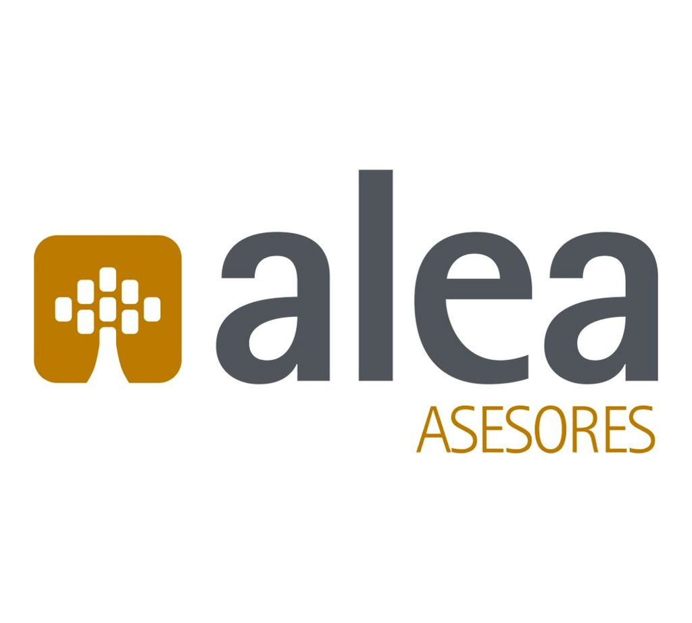
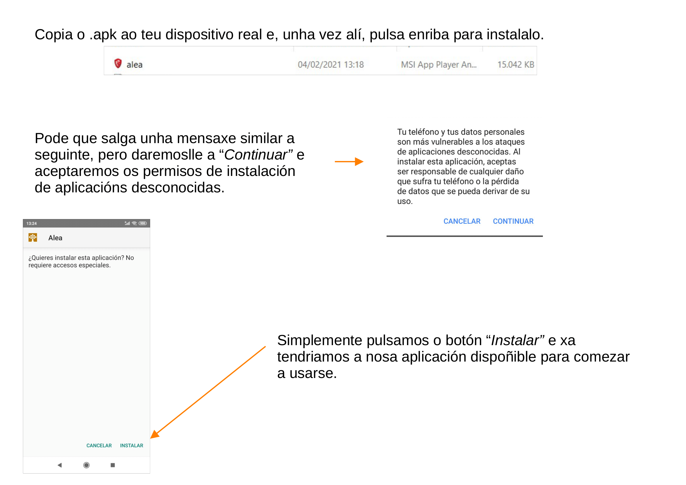

# ALEA 
 
 
 ## Software Empregado

 

## Descripción
Alea app é unha aplicación que pretende dar solución a algúns aspectos descritos pola [lei de fichaxes](https://www.boe.es/buscar/doc.php?id=BOE-A-2019-3481) establecida no 2019 para o entorno empresarial.

Ao mesmo tempo dispón de outras funcionalidades, tamén útiles, tanto para os empregados como para os administradores, como son a entrega de nóminas a través da aplicación, envío de e-mails, chamadas entre empregados, notas personais, etc. 
 
A aplicación está diseñada para esta empresa en concreto.

O proxecto consta de duas aplicacións: 
 * **Alea App**, que contén todo o necesario para a autoxestión. Esta será instalada no dispositivo móbil de cada empregado.
 * **Alea scanner**, que consiste nun lector QR, que permite rexistrar os fichaxes. Esta será instalada nun dispositivo fixo da empresa.

## Instalación / Puesta en marcha
Descarga os seguintes .apk:
* [Alea_App.apk](/Alea_App.apk)
* [Alea_Scanner.apk](/Alea_Scanner.apk)

Se desexas instalar a aplicación de maneira distinta a anterior, e poñela en marcha a través de Android Studio, podes seguir os pasos a través do seguinte [Manual de Instalación.](documentacion/MANUAL_INSTALACIÓN.pdf)

## Uso

A aplicación pretende ser o máis intuitiva posible, diferenciando se o usuario é un empregado ou un administrador.

**Os empregados poden:**
   * Facer uso do calendario, engadir e eliminar eventos.
   * Descargar ou visualizar as súas nóminas.
   * Comunicarse con outros empregados mediante teléfono ou e-mail.
   * Cambiar algúns aspectos da sua configuración personal.
   * Xerar un código QR para realizar a fichaxe na aplicación Alea Scanner.
   * Fichar mediante GPS.

**Os administradores poden:**
   * Realizar as mesmas accións que os empregados.
   * Administrar aos empregados, creando novos perfiles, editando e eliminandoos.
   * Subir as nóminas para todos os empregados.
   * Descargar un excel co historial de fichaxes por cada empregado.

Para calquera dúbida, visualizar o seguinte [MANUAL DE USO.](documentacion/MANUAL_USO_ALEA.pdf) 

## Sobre el autor
Lidia Loureiro Facal, actual estudante do Ciclo Superior de **Desenvolvemento de Aplicacións Multiplataforma** no IES San Clemente (Santiago de Compostela).

Escollín programar en Android, xa que actualmente case toda a poboación dispón de un smartphone con este sistema operativo, polo que permite un gran abanico de oportunidades.

_Email:_ lidialoureirofacal@gmail.com

## Licencia
[LICENCIA](/LICENSE)

[*GNU Free Documentation License Version 1.3*](https://www.gnu.org/licenses/fdl-1.3.html). 

## Índice

1. [Anteproyecto](documentacion/Idea_Anteproxecto.pdf)
    * 1.1. [Idea](doc/templates/1_idea.md)
    * 1.2. [Necesidades](doc/templates/2_necesidades.md)
2. [Análisis](doc/templates/3_analise.md)
3. [Planificación](doc/templates/4_planificacion.md)
4. [Diseño](doc/templates/5_deseño.md)
5. [Implantación](doc/templates/6_implantacion.md)

## Guía de contribución

Podrase contribuir no proxecto mediante a realización de novas funcionalidades, corrección e optimización de código, refactorización, realización de tests automatizados, novas interfaces de integración, etc.

Para calquera aportación contactar por e-mail co asunto _Contribución proxecto Alea_.

## Links

Desenvolvemento do prototipo: [Proto.io](https://proto.io/)

Iconos da aplicación: [FeatherIcons.com](https://feathericons.com/)

Firebase: [Firebase.google.com](https://firebase.google.com/?hl=es)
